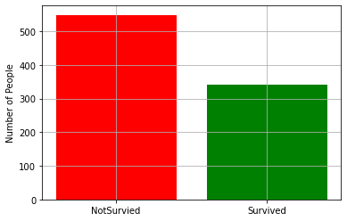
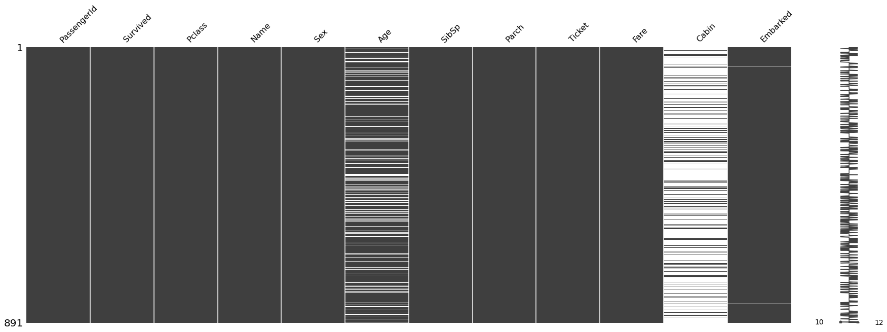

# Titanic Survival Prediction: 
## Project Overview

* Predicting which person survived through the titanic deseaster
* Evaluate with different models for example: Decision Tree Classifier, Gaussian Naive Bayes 

## Code and Resources Used
* **Programming Language:** Python
* **Packages:** Pandas, Numpy, Matplotlib, Missingno, Sklearn
* **Data:** [Kaggle Dataset](https://www.kaggle.com/competitions/titanic/data)

## EDA
* **Shape of the train data:** 819 rows, 12 columns
* **Target:** 0 (not survived), 1 (survived)

* **Missing Data:**

only missing values at three columns (age (177), cabine(687) and embarked (2))
* **Surviving rate between men and women**

